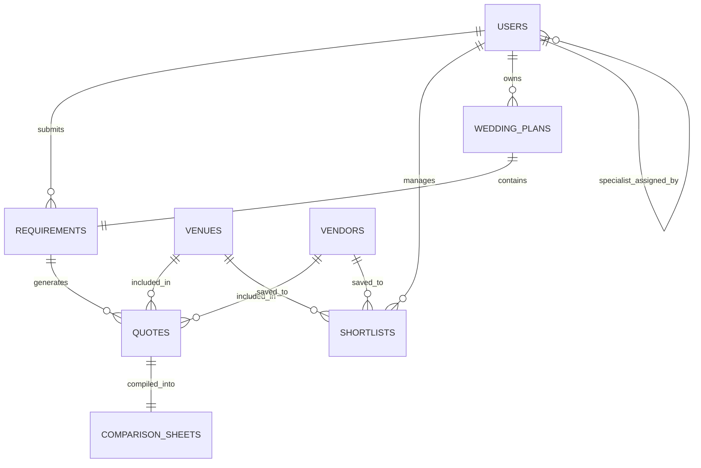

max 250 lines

# DATABASE & SECURITY

## Supabase Overview & Policies
- **Database Tables Model:**
  - `profiles` — Stores customer, vendor, and admin roles.
  - `venues` — Properties metadata, capacity limits, and pricing.
  - `shortlists` — Many-to-many relationship tracking user selections.
  - `quotes` — Custom rates, options inclusions, and status tracking.
- **RLS & Validation:** Never bypass Row Level Security (RLS), validation, or user permissions. Database access must go through the service layer.
- **Storage Buckets & Migrations:** [To be defined / adhered to as the project scales]

## Entity Relationship Overview

## Table Definitions

### `users`
Managed by Supabase Auth. Extended with profile data in a separate `profiles` table.
- `id` (uuid) PK
- `email` (text)
- `role` (text) Enum: `customer`, `admin`, `vendor`
- `created_at` (timestamptz)

### `profiles`
Extended user profile data beyond auth.
- `id` (uuid) FK -> `users.id`
- `full_name` (text)
- `phone_number` (text)
- `avatar_url` (text)
- `updated_at` (timestamptz)

### `requirements`
A couple's submitted wedding planning requirements. The trigger for the concierge workflow.
- `id` (uuid) PK
- `customer_id` (uuid) FK -> `users.id`
- `assigned_specialist_id` (uuid) FK -> `users.id` (admin)
- `event_type` (text) Enum
- `event_date` (date)
- `guest_count_range` (text)
- `budget_range` (text)
- `location_preference` (text)
- `additional_notes` (text)
- `status` (text) Enum
- `created_at` (timestamptz)
- `updated_at` (timestamptz)

### `venues`
YMWA-vetted wedding venue partners.
- `id` (uuid) PK
- `name` (text)
- `slug` (text)
- `location` (text)
- `capacity_min` (integer)
- `capacity_max` (integer)
- `price_onwards_lakhs` (numeric)
- `catering_model` (text) Enum
- `image_url` (text)
- `is_popular` (boolean)
- `is_active` (boolean)
- `vetted_by` (uuid) FK -> `users.id`
- `rating` (numeric)

### `vendors`
YMWA-vetted wedding vendor partners.
- `id` (uuid) PK
- `name`, `slug`, `category`, `location`, `price_start_lakhs`, `image_url`, `is_active`, `vetted_by`, `rating`

### `quotes`
Individual quotations collected by a YMWA specialist for a specific requirement.
- `id` (uuid) PK
- `requirement_id` (uuid) FK -> `requirements.id`
- `venue_id` (uuid) FK -> `venues.id` (null if vendor quote)
- `vendor_id` (uuid) FK -> `vendors.id` (null if venue quote)
- `collected_by` (uuid) FK -> `users.id` (Must be a specialist, no auto-generated quotes)
- `package_name`, `base_cost_lakhs`, `catering_included`, `inclusions`, `exclusions`, `notes`, `valid_until`

### `shortlists`
A couple's saved venues and vendors.
- `id` (uuid) PK
- `customer_id` (uuid) FK -> `users.id`
- `venue_id` (uuid) FK -> `venues.id`
- `vendor_id` (uuid) FK -> `vendors.id`
- Constraint: exactly one of `venue_id` or `vendor_id` must be non-null.
