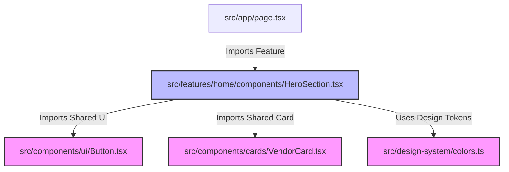

# YouMarriageWeArrange (YMWA) — Architectural Guide & Project Structure

Welcome to the project structure and architectural guide for **YouMarriageWeArrange**, a premium wedding marketplace and planning platform built on Next.js 15 (App Router), TypeScript, Tailwind CSS, shadcn/ui, Framer Motion, and prepared for Supabase integration.

This document serves as the ground truth for developers on directory organization, component reuse, monorepo migration pathways, and codebase best practices.

---

## 1. Directory Tree Walkthrough

Our project structure follows a **Feature-Driven Architecture** within the Next.js `src/` directory. Each route, component, and utility is isolated to prevent cross-feature pollution and enable clean scaling.

```text
youmarriagewearrange/
├── public/                         # Static files served directly by the web server
│   ├── assets/
│   │   ├── images/                 # Product/promotional marketing images
│   │   ├── icons/                  # Custom SVGs / favicons
│   │   └── logos/                  # Brand assets & partner logos
│   └── templates/                  # Digital invitations & website preview mockups
├── src/
│   ├── app/                        # Next.js 15 App Router Routes (Entrypoints only)
│   │   ├── (auth)/                 # Route Group: Guest auth pages (Login, Register, etc.)
│   │   ├── (dashboard)/            # Route Group: Portals for authenticated users
│   │   │   ├── admin/              # Admin-specific route folder structure
│   │   │   └── customer/           # Customer-specific dashboard route folder structure
│   │   └── (public)/               # Route Group: Marketing, details pages, static files
│   ├── components/                 # Shared generic UI (Design system primitives & wrappers)
│   │   ├── ui/                     # shadcn/ui core components (atomic elements)
│   │   ├── layout/                 # Main shells (Header, Footer, Sidebars)
│   │   ├── feedback/               # Modals, Dialogs, Toast notifications
│   │   ├── form/                   # Form inputs, selectors, check-boxes
│   │   ├── motion/                 # Reusable Framer Motion transitions
│   │   └── cards/                  # Standardized cards reused across lists
│   ├── design-system/              # Centralized token definitions for visual consistency
│   ├── seo/                        # Shared SEO helpers & schemas
│   ├── middleware/                 # Endpoint route handlers / checks (Auth, Roles, Logs)
│   ├── features/                   # Self-contained feature modules (Business logic)
│   │   ├── shared/                 # Feature-specific utility features (e.g., search logic)
│   │   ├── home/                   # Homepage component & layout definitions
│   │   ├── shortlist/              # Shortlisting cart, quote tracking logic
│   │   ├── comparison/             # Side-by-side matrices
│   │   ├── invitations/            # Invitation builder engine
│   │   └── ...                     # Other modules (auth, blog, quotes, vendors, etc.)
│   ├── services/                   # Backend clients, external API abstractions
│   ├── hooks/                      # Global UI hooks (e.g. useMediaQuery)
│   ├── lib/                        # Third party initializations (Supabase, Stripe)
│   ├── types/                      # Global TypeScript definitions
│   ├── constants/                  # Constant variables & configurations
│   ├── utils/                      # Pure helper functions
│   ├── styles/                     # Tailwind globals.css, theme fonts
│   └── mock-data/                  # Static mock JSON db (replaced by Supabase in Phase 2)
```

---

## 2. Directory & File Walkthrough

### `src/app/`
Contains routes defined using standard Next.js 15 routing. **Keep route files lean.** A `page.tsx` should import components from the corresponding folder in `src/features/` rather than defining complex components inline.
- **Route Groups `(auth)`, `(dashboard)`, `(public)`:** Used to group routes with shared layout contexts (e.g., dashboard sidebar vs. marketing header) without impacting the URL.
- **Static Inspiration Routes:** Flatter routes (e.g., `/inspiration/bridal-wear`) are structured directly under `(public)/inspiration` instead of dynamic `[category]` to optimize SEO indexing and ranking.

### `src/design-system/`
Holds centralized UI design tokens used to synchronize our components.
- `colors.ts`: Configures tailored color palette (HSL matching).
- `typography.ts`: Global font styling and sizes.
- `spacing.ts`: Spacing tokens (gaps, margins, padding scale).
- `shadows.ts`: Custom premium shadow depths.
- `radius.ts`: Standardized border radii.
- `breakpoints.ts`: Responsiveness window sizes.
- `theme.ts`: Base theme unifying tokens.

### `src/seo/`
Centralizes our search engine optimizations:
- `metadata.ts`: Dynamically generates meta tags, titles, and descriptions.
- `sitemap.ts`: Auto-generates the site map from inspiration/blog collections.
- `robots.ts`: Declares bots rules.
- `schema.ts`: Holds structured schemas (JSON-LD) for `LocalBusiness` (vendors), `Event` (weddings), and `Product` (venues) to win Google rich snippet cards.

### `src/middleware/`
Separates request checking files:
- `auth.ts`: Guest routing/authentication check.
- `admin.ts` & `customer.ts`: Route role guards.
- `roles.ts`: Access mapping matrix.

### `src/features/`
Each feature is a cohesive domain unit. Inside each feature (e.g., `src/features/vendors/`), structure files as:
- `/components/` — Vendor-specific views (e.g., `VendorGallery`, `ReviewList`).
- `/hooks/` — Feature hooks (e.g., `useVendorFilters`).
- `/services/` — Feature fetchers (e.g., `getVendorById`).
- `types.ts` — Local Types.
- `constants.ts` — Local constants.

### `src/components/cards/`
Card representations are reused across several feature boundaries:
- `VenueCard.tsx`: Displays a venue grid preview item (used in search, shortlists, comparisons).
- `VendorCard.tsx`: Displays a vendor card (used in Category page, related vendors slider, homepage).
- `InspirationCard.tsx`: Grid item for image inspirations.
- `TestimonialCard.tsx`: Customer review/testimonial card.
- `TemplateCard.tsx`: Design themes selection.

### `src/mock-data/`
Standardized local JSON/mock-data directory. By utilizing a separate mock directory, we can swap static lists (such as venue directories or invitation templates) with active database clients (like Supabase) in Phase 2 simply by changing the service imports.

---

## 3. Recommended Naming Conventions

Maintain strict naming consistency to prevent developer confusion:

| Target | Convention | Example |
| :--- | :--- | :--- |
| **Component Files** | PascalCase | `VenueCard.tsx`, `HeroSection.tsx` |
| **Utility Files / Hooks** | camelCase | `formatCurrency.ts`, `useAuth.ts` |
| **Directories** | kebab-case | `venue-comparison/`, `forgot-password/` |
| **Route Group Folders** | (kebab-case) | `(auth)/`, `(dashboard)/` |
| **Types / Interfaces** | PascalCase | `VendorDetails`, `VenueComparisonMatrix` |
| **Style Classes** | Tailwind utilities / BEM | `flex items-center justify-between` |

---

## 4. Architectural Rules & Component Boundaries



### Dependency Rules:
1. **No Circular Feature Dependencies:** A feature under `src/features/` should **never** import from another feature (e.g., `features/vendors` must not import from `features/venues`). If sharing components or hooks is necessary, move them to `src/components/` or `src/features/shared/`.
2. **Lean App Router:** Keep components in `src/app/` down to layout wrapping, dynamic parameter resolution, metadata injection, and page page component assembly.
3. **No Direct styling / spacing assumptions:** Use styling configuration values from `@/design-system` inside custom styling sheets or CSS files.

---

## 5. Team Best Practices (6 Developers)

For a team of 6 developers, follow these coordination guardrails:
1. **GitHub PR Templates:** Require linting confirmation and visual representation (screenshot/recording) for UI updates.
2. **Branching Strategy:** Standard git flow: `feature/YMWA-[task-id]-feature-name` branching from `main`. Keep pull requests scoped to single features (e.g., `shortlist`).
3. **Feature Ownership:** Assign developers to individual modules (e.g., Developer A on `venues`, Developer B on `vendors`, Developer C on `invitations`) to minimize merge conflicts.
4. **Tailwind Class Order:** Enforce class ordering via Prettier plugin (`prettier-plugin-tailwindcss`) to keep UI classes consistent across developer styles.
5. **Supabase Migration strategy:** Ensure Supabase calls are contained strictly within `/services` folders to isolate local development from server-side implementations.

---

## 6. Monorepo Migration Pathway (Phase 2)

When the project scales and requires a separate Vendor App, Mobile App, and shared packages, we will migrate to a **Turborepo** layout.

### Shared Workspace Target Structure:
```text
youmarriagewearrange-monorepo/
├── apps/
│   ├── web/                    # Current src/app/(public) & (dashboard)/customer
│   ├── admin/                  # Current src/app/(dashboard)/admin
│   ├── vendor/                 # [NEW] Phase 2 Vendor Portal
│   └── mobile/                 # React Native / Expo application
├── packages/
│   ├── ui/                     # Current src/components/ui, src/components/layout
│   ├── design-system/          # Current src/design-system/ (Colors, spacing, typography)
│   ├── seo/                    # Current src/seo/
│   ├── auth/                   # Current src/features/auth/ & src/middleware/auth.ts
│   ├── database/               # Current src/services/supabase & prisma mapping
│   ├── config/                 # Shared eslint, tsconfig, tailwind presets
│   └── utils/                  # Current src/utils/ & src/constants/
```

### Migration Steps:
1. **Scaffold Turbo:** Initialize Turborepo using `npx create-turbo@latest`.
2. **Extract packages/design-system:** Move `src/design-system/` to `packages/design-system` and expose design tokens.
3. **Extract packages/ui:** Port `src/components/ui/` to `packages/ui` and build components on top of the shared design system package.
4. **Split apps:** Move portals from route groups:
   - `src/app/(public)` -> `apps/web/`
   - `src/app/(dashboard)/admin` -> `apps/admin/`
5. **Resolve package imports:** Update path references from `@/components` to `youmarriagewearrange-ui` and `@/design-system` to `youmarriagewearrange-theme`.
