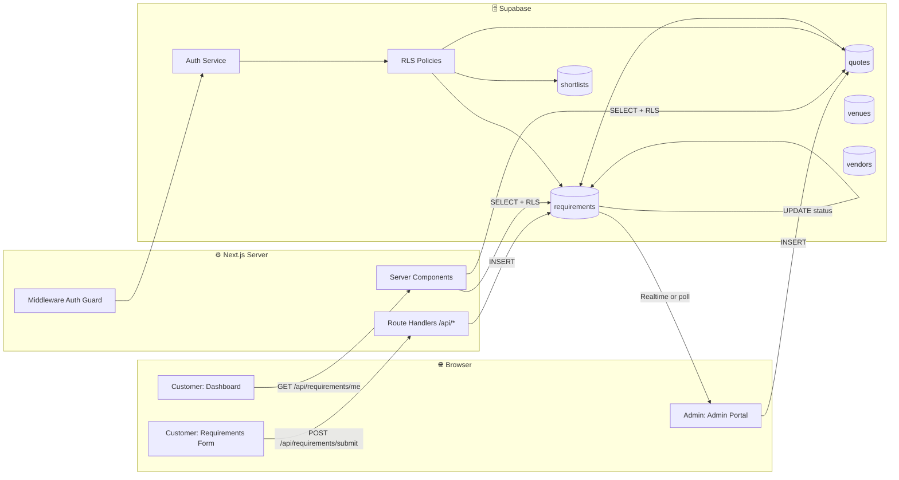
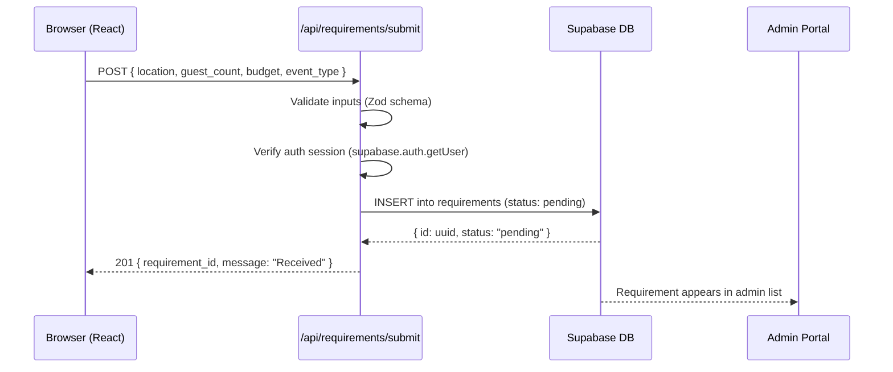
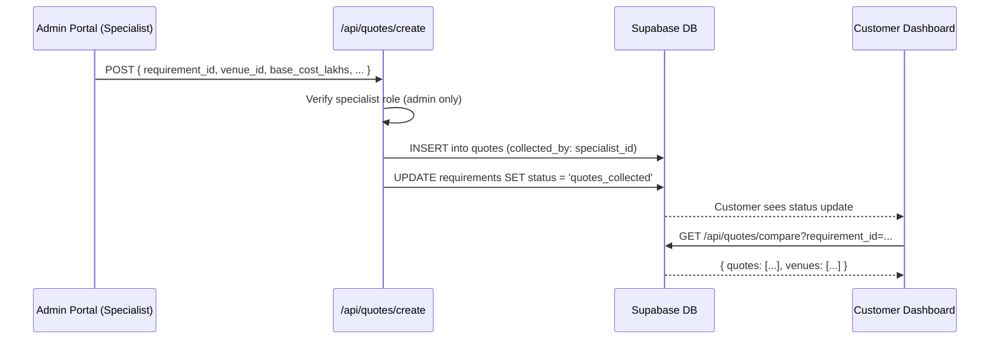
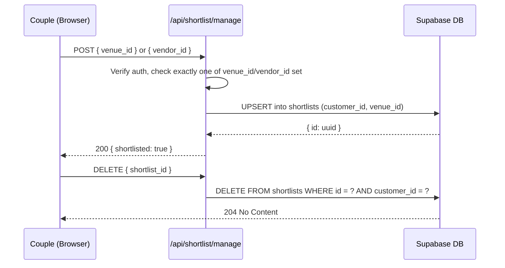

# YMWA — Data Flow Architecture

This document maps how data moves through the YouMarriageWeArrange system layers — from the couple's browser through the server, into Supabase, through the admin portal, and back to the customer dashboard.

---

## 1. Full System Data Flow



---

## 2. Requirements Submission Flow



---

## 3. Comparison Sheet Data Flow



---

## 4. Authentication Data Flow

```mermaid
flowchart TD
    Request[HTTP Request] --> MW[src/middleware.ts]
    MW --> SC[supabase.auth.getUser]
    SC --> SB[Supabase Auth Service]
    SB --> TK{Token Valid?}
    TK -->|No| RL[Redirect /login]
    TK -->|Yes| Role{Check user.role}
    Role -->|customer| Cust[Allow /customer/* routes]
    Role -->|admin| Adm[Allow /admin/* routes]
    Role -->|unauthenticated| Pub[Allow /(public)/* routes]
```

---

## 5. Shortlist Data Flow



---

## 6. Service Layer Architecture

All database access must go through the service layer. Direct Supabase client calls are **never permitted inside React components**.

```
Component (TSX)
    ↓
Custom Hook (useRequirements, useShortlist)
    ↓
Service Function (src/services/supabase/ or features/*/services/)
    ↓
Supabase Client (browser or server)
    ↓
Supabase DB (with RLS)
```

### Service File Locations

| Service | File Path |
|:---|:---|
| Supabase browser client | `src/services/supabase/client.ts` |
| Supabase server client | `src/services/supabase/server.ts` |
| Requirements service | `src/features/customer/services/requirements.service.ts` |
| Quotes service | `src/features/quotes/services/quotes.service.ts` |
| Shortlist service | `src/features/shortlist/services/shortlist.service.ts` |
| Venue service | `src/features/venues/services/venues.service.ts` |
| Vendor service | `src/features/vendors/services/vendors.service.ts` |

---

## 7. API Route Handler Pattern

All Route Handlers at `src/app/api/*/route.ts` follow this structure:

```typescript
// 1. Parse and validate request body (Zod)
// 2. Verify authentication (supabase.auth.getUser)
// 3. Verify role authorization if needed
// 4. Call service function (never direct DB call in route handler)
// 5. Return JSON response with correct HTTP status code

export async function POST(request: Request) {
  // 1. Parse
  const body = await request.json();
  const parsed = schema.safeParse(body);
  if (!parsed.success) return Response.json({ error: "Invalid input" }, { status: 400 });

  // 2. Auth
  const supabase = createServerClient();
  const { data: { user } } = await supabase.auth.getUser();
  if (!user) return Response.json({ error: "Unauthorized" }, { status: 401 });

  // 3. Service call
  const result = await requirementsService.create({ ...parsed.data, customerId: user.id });

  // 4. Response
  return Response.json(result, { status: 201 });
}
```
