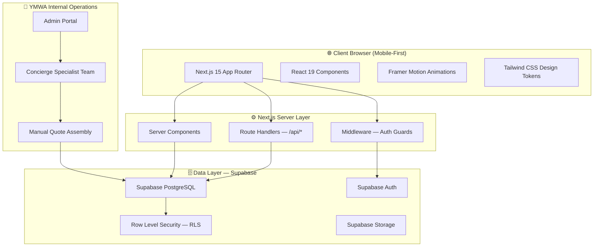
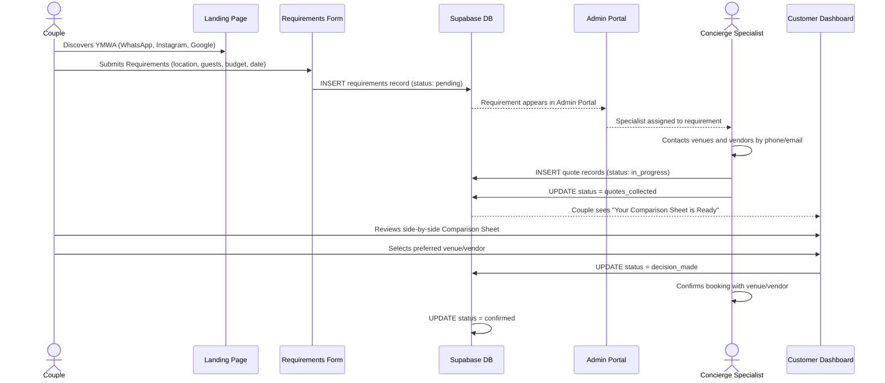

# YMWA — System Architecture Diagram

This document describes the platform architecture of YouMarriageWeArrange using layer diagrams.

---

## 1. High-Level Platform Layers



---

## 2. Request Flow — Customer Journey



---

## 3. App Router Directory Map

```
src/app/
├── layout.tsx                    ← Root: html, body, fonts, global providers
├── page.tsx                      ← Public homepage (assembles home feature sections)
│
├── (public)/                     ← Public marketing layout group
│   ├── layout.tsx                ← Fragment wrapper (no html/body repeat)
│   ├── venues/page.tsx           ← Venue discovery page
│   ├── vendors/page.tsx          ← Vendor discovery page
│   └── blog/page.tsx             ← Wedding inspiration blog
│
├── (auth)/                       ← Authentication route group
│   ├── layout.tsx
│   ├── login/page.tsx
│   └── register/page.tsx
│
└── (dashboard)/                  ← Authenticated user areas
    ├── layout.tsx                ← Checks auth session
    ├── customer/
    │   ├── dashboard/page.tsx    ← Wedding Plan overview
    │   ├── shortlist/page.tsx    ← Saved venues and vendors
    │   └── comparison/page.tsx   ← Comparison Sheet viewer
    └── admin/
        ├── dashboard/page.tsx    ← Internal: requirement management
        ├── quotes/page.tsx       ← Internal: quote assembly
        └── venues/page.tsx       ← Internal: venue vetting
```

---

## 4. Feature Module Structure

Each feature in `src/features/` follows this internal structure:

```
features/[domain]/
├── components/     ← Feature-specific UI (not shared across other features)
├── hooks/          ← Feature-specific React hooks
├── services/       ← Data access functions (calls Supabase, never in components)
├── types/          ← Feature-specific TypeScript interfaces
└── constants/      ← Feature-specific static data
```

Shared atoms (used across multiple features) live in `src/components/`:

```
src/components/
├── cards/
│   ├── VenueCard.tsx
│   ├── VendorCard.tsx
│   ├── TestimonialCard.tsx
│   ├── InspirationCard.tsx
│   └── TemplateCard.tsx
├── form/
├── layout/
├── motion/
├── ui/
└── feedback/
```

---

## 5. Authentication & Role Flow

```mermaid
flowchart TD
    Request[Incoming Request] --> Middleware[src/middleware.ts]
    Middleware --> CheckSession{Session Valid?}
    CheckSession -->|No| RedirectLogin[Redirect to /login]
    CheckSession -->|Yes| CheckRole{Check Role}
    CheckRole -->|customer| CustomerDashboard[/customer/dashboard]
    CheckRole -->|admin| AdminPortal[/admin/dashboard]
    CheckRole -->|vendor| VendorPortal[Future: /vendor/*]
    CheckRole -->|unauthenticated public| PublicRoutes[/(public)/*]
```

Roles:
- `customer` — Couples using the platform
- `admin` — YMWA concierge specialists and team
- `vendor` — Future Phase 3 vendor portal access

---

## 6. Design System Token Flow

```
DESIGN_SYSTEM.md
      ↓
src/design-system/theme.ts   ← JavaScript/TypeScript token source
      ↓
tailwind.config.ts           ← Extended Tailwind token map
      ↓
All TSX components           ← Use token class names, never raw hex
```

No component should bypass this chain by using `bg-[#8B263E]` when `bg-primary` exists.
