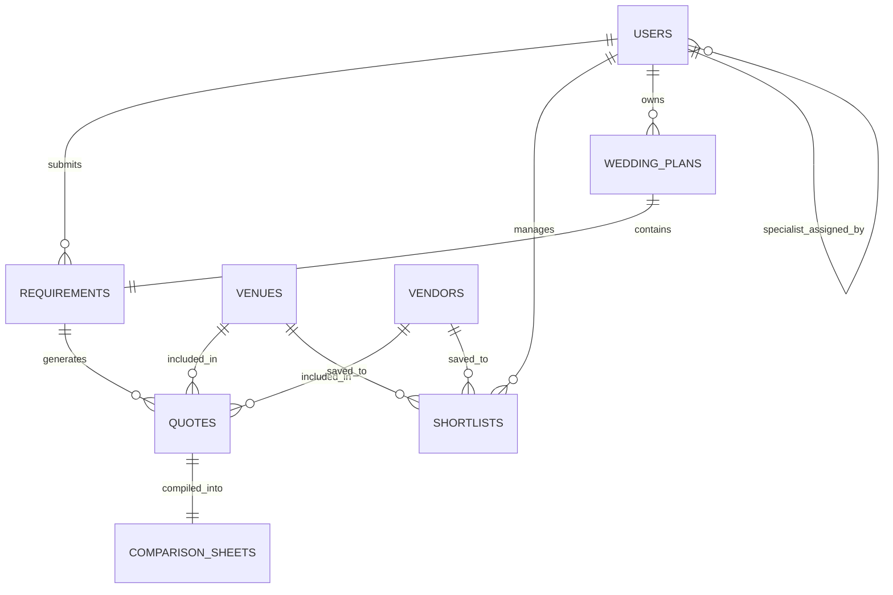

# YMWA — Database Schema

This document defines all Supabase PostgreSQL tables, columns, types, and relationships for YouMarriageWeArrange.

> [!IMPORTANT]
> All column names use `snake_case`. All enum values use lowercase. Table names are plural nouns. No exceptions.

---

## Entity Relationship Overview

---

## Table Definitions

### `users`

Managed by Supabase Auth. Extended with profile data in a separate `profiles` table.

| Column | Type | Nullable | Description |
|:---|:---|:---:|:---|
| `id` | `uuid` | No | Primary key — mirrors `auth.users.id` |
| `email` | `text` | No | User email |
| `role` | `text` | No | Enum: `customer`, `admin`, `vendor` |
| `created_at` | `timestamptz` | No | Auto-set on insert |

---

### `profiles`

Extended user profile data beyond auth.

| Column | Type | Nullable | Description |
|:---|:---|:---:|:---|
| `id` | `uuid` | No | FK → `users.id` |
| `full_name` | `text` | Yes | Display name |
| `phone_number` | `text` | Yes | WhatsApp-reachable number |
| `avatar_url` | `text` | Yes | Profile image URL |
| `updated_at` | `timestamptz` | No | Auto-updated |

---

### `requirements`

A couple's submitted wedding planning requirements. The trigger for the concierge workflow.

| Column | Type | Nullable | Description |
|:---|:---|:---:|:---|
| `id` | `uuid` | No | Primary key |
| `customer_id` | `uuid` | No | FK → `users.id` |
| `assigned_specialist_id` | `uuid` | Yes | FK → `users.id` (admin role) |
| `event_type` | `text` | No | Enum: `wedding_ceremony`, `reception`, `mehendi`, `sangeet`, `haldi`, `engagement` |
| `event_date` | `date` | Yes | Target event date |
| `guest_count_range` | `text` | No | E.g. `200 - 500 Guests` |
| `budget_range` | `text` | No | E.g. `₹25L - ₹50 Lakhs` |
| `location_preference` | `text` | No | Area in Hyderabad |
| `additional_notes` | `text` | Yes | Free-text notes from the couple |
| `status` | `text` | No | Enum: `pending`, `in_progress`, `quotes_collected`, `comparison_ready`, `decision_made`, `confirmed`, `archived` |
| `created_at` | `timestamptz` | No | Auto-set |
| `updated_at` | `timestamptz` | No | Auto-updated |

---

### `venues`

YMWA-vetted wedding venue partners.

| Column | Type | Nullable | Description |
|:---|:---|:---:|:---|
| `id` | `uuid` | No | Primary key |
| `name` | `text` | No | Venue display name |
| `slug` | `text` | No | URL-safe identifier (e.g. `taj-falaknuma-palace`) |
| `location` | `text` | No | Area + `, Hyderabad` |
| `capacity_min` | `integer` | No | Minimum guest capacity |
| `capacity_max` | `integer` | No | Maximum guest capacity |
| `price_onwards_lakhs` | `numeric` | No | Starting price in lakhs (numeric, for display only — not for sorting) |
| `catering_model` | `text` | No | Enum: `in_house`, `external_allowed`, `flexible` |
| `image_url` | `text` | No | Primary image URL |
| `is_popular` | `boolean` | No | Manually curated popular flag |
| `is_active` | `boolean` | No | Soft delete / visibility flag |
| `vetted_by` | `uuid` | No | FK → `users.id` (admin who approved this venue) |
| `rating` | `numeric` | Yes | Concierge-curated editorial rating (1.0–5.0) |
| `created_at` | `timestamptz` | No | Auto-set |
| `updated_at` | `timestamptz` | No | Auto-updated |

---

### `vendors`

YMWA-vetted wedding vendor partners.

| Column | Type | Nullable | Description |
|:---|:---|:---:|:---|
| `id` | `uuid` | No | Primary key |
| `name` | `text` | No | Vendor display name |
| `slug` | `text` | No | URL-safe identifier |
| `category` | `text` | No | Enum: `photographer`, `caterer`, `decorator`, `makeup_artist`, `coordinator` |
| `location` | `text` | No | Area + `, Hyderabad` |
| `price_start_lakhs` | `numeric` | No | Minimum package price in lakhs |
| `image_url` | `text` | No | Primary image URL |
| `is_active` | `boolean` | No | Visibility flag |
| `vetted_by` | `uuid` | No | FK → `users.id` (admin who approved this vendor) |
| `rating` | `numeric` | Yes | Concierge-curated editorial rating |
| `created_at` | `timestamptz` | No | Auto-set |

---

### `quotes`

Individual quotations collected by a YMWA specialist for a specific requirement.

| Column | Type | Nullable | Description |
|:---|:---|:---:|:---|
| `id` | `uuid` | No | Primary key |
| `requirement_id` | `uuid` | No | FK → `requirements.id` |
| `venue_id` | `uuid` | Yes | FK → `venues.id` (null if this is a vendor quote) |
| `vendor_id` | `uuid` | Yes | FK → `vendors.id` (null if this is a venue quote) |
| `collected_by` | `uuid` | No | FK → `users.id` — **MUST be a specialist. No auto-generated quotes.** |
| `package_name` | `text` | No | Name of the package negotiated |
| `base_cost_lakhs` | `numeric` | No | Base cost in lakhs |
| `catering_included` | `boolean` | No | Whether catering is part of this quote |
| `inclusions` | `text[]` | Yes | Array of included services |
| `exclusions` | `text[]` | Yes | Array of excluded services |
| `notes` | `text` | Yes | Specialist notes about this quote |
| `valid_until` | `date` | Yes | Quote expiry date |
| `created_at` | `timestamptz` | No | Auto-set |

---

### `shortlists`

A couple's saved venues and vendors.

| Column | Type | Nullable | Description |
|:---|:---|:---:|:---|
| `id` | `uuid` | No | Primary key |
| `customer_id` | `uuid` | No | FK → `users.id` |
| `venue_id` | `uuid` | Yes | FK → `venues.id` |
| `vendor_id` | `uuid` | Yes | FK → `vendors.id` |
| `created_at` | `timestamptz` | No | Auto-set |

Constraint: exactly one of `venue_id` or `vendor_id` must be non-null.

---

## Naming Conventions

| Pattern | Convention | Example |
|:---|:---|:---|
| Table names | `snake_case`, plural | `requirements`, `wedding_plans` |
| Column names | `snake_case` | `collected_by`, `event_date` |
| Boolean columns | Prefixed with `is_` | `is_active`, `is_popular` |
| Timestamp columns | Suffixed with `_at` | `created_at`, `updated_at` |
| Foreign keys | `referenced_table_singular_id` | `customer_id`, `venue_id` |
| Enum values | `snake_case`, lowercase | `in_house`, `in_progress` |
| Price columns | Suffixed with `_lakhs` | `base_cost_lakhs`, `price_onwards_lakhs` |
