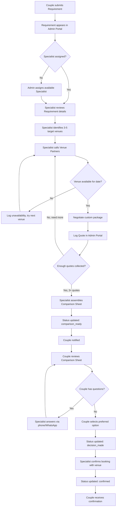

# YMWA — Concierge Operations Flow

This document maps the internal YMWA team workflow that powers the concierge model. This is the "invisible" half of the product that creates the value couples receive.

---

## Concierge Operations Overview

---

## Specialist Responsibilities by Stage

### Stage 1: Requirement Review (Target: Within 2 hours of submission)

**Actions:**
1. Open new requirement in Admin Portal
2. Read all requirement fields: event type, date, guest count, budget range, location preference
3. Cross-reference with known venues in the requested area that fit the budget
4. Create a target list of 3–5 venues to contact

**Checklist before calling:**
- [ ] Guest count fits the venue's capacity range
- [ ] Budget range aligns with venue's typical pricing
- [ ] Event date is not a known blackout period for the venue
- [ ] Venue is marked `is_active` in the database

---

### Stage 2: Venue Contact & Negotiation (Target: Within 24 hours)

**Contact script structure:**
1. Introduce as YMWA concierge representative
2. Confirm availability for the event date
3. Request a custom package for the stated guest count and budget
4. Ask about catering model and flexibility
5. Get a formal quote in writing (email or WhatsApp)
6. Negotiate if the initial quote exceeds the couple's stated budget

**Quote logging requirements:**
Every quote logged in the Admin Portal must include:
- Venue name (linked to `venues` table)
- Package name
- Base cost in lakhs
- Catering model (in-house / external allowed)
- Inclusions list
- Exclusions list
- Quote validity date
- Specialist notes (any negotiated conditions, special inclusions, caveats)

---

### Stage 3: Comparison Sheet Assembly (Target: Within 48–72 hours)

**Assembly guidelines:**
- Minimum 2 quotes required before a comparison sheet can be shared (3 preferred)
- Maximum 5 quotes on a single comparison sheet (more causes decision paralysis)
- Order quotes by specialist recommendation, not by price
- Highlight the specialist-recommended option with a note explaining the recommendation rationale

**Quality checks before marking `comparison_ready`:**
- [ ] All prices are confirmed as of today's date
- [ ] All catering models are accurately captured
- [ ] Specialist notes are written from the couple's perspective, not the venue's
- [ ] No venue is listed that has not confirmed availability in writing

---

### Stage 4: Couple Communication

**Notification triggers:**
| Event | Communication Method |
|:---|:---|
| Requirement received | Confirmation message on platform (Phase 1), Email (Phase 1.5) |
| Specialist assigned | No notification (internal only) |
| Comparison sheet ready | Email notification (Phase 1.5), WhatsApp (Phase 2) |
| Couple selects venue | Specialist follow-up call within 4 hours |
| Booking confirmed | Formal confirmation message with specialist contact details |

---

### Stage 5: Booking Confirmation

Once the couple selects their preferred option:

1. Specialist contacts the venue to formally confirm the booking under the negotiated package
2. Specialist verifies the following with the venue:
   - Date locked for the couple
   - Package price confirmed in writing
   - Advance payment terms communicated to the couple
3. Status updated to `confirmed` in the Admin Portal
4. Couple receives confirmation message with:
   - Venue name and contact
   - Package summary
   - Specialist's direct WhatsApp for follow-up questions

---

## SLA Targets

| Stage | Target Time |
|:---|:---:|
| Specialist assignment | 2 hours |
| First venue contact | 4 hours |
| Comparison sheet ready | 48–72 hours |
| Couple selects and specialist confirms | 4 hours |
| Formal booking confirmation to couple | 24 hours |

---

## Admin Portal Required Features (Phase 1.5)

For this flow to operate, the Admin Portal needs:

- [ ] Requirement list view with status filters
- [ ] Requirement detail view with all submitted fields
- [ ] Quote logging form (per requirement)
- [ ] Comparison sheet preview (before sending to couple)
- [ ] Status update controls
- [ ] Specialist assignment dropdown
