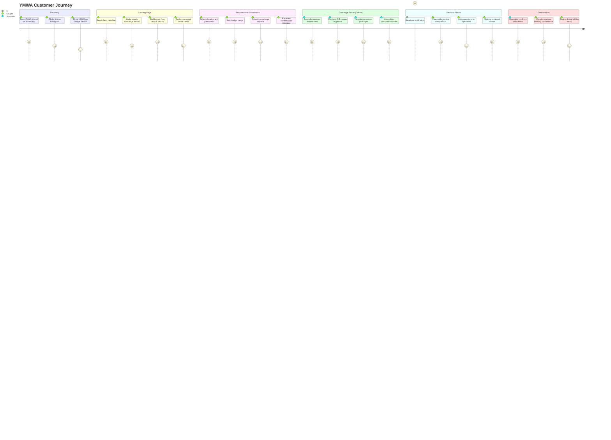

# YMWA — Customer Journey Flow

This document maps the complete customer journey through the YouMarriageWeArrange platform, from first discovery to confirmed booking.

---

## Journey Overview



---

## Detailed Stage Breakdown

### Stage 1: Discovery

**How couples find YMWA:**
- WhatsApp share link (primary — links from previous YMWA couples or vendors)
- Instagram organic or paid discovery
- Google Search: "wedding venues Hyderabad concierge", "wedding planner Hyderabad"

**First impression objectives:**
- Communicate premium positioning in under 3 seconds
- Visually differentiate from directory competitors (Banjara Hills imagery, not stock confetti)
- Build curiosity about "what is a wedding concierge?"

---

### Stage 2: Landing Page Journey (DREAM → CELEBRATE)

| Section | Journey Stage | Primary Objective | Success Metric |
|:---|:---:|:---|:---|
| **Hero** | DREAM | Communicate "We'll find perfect venues for you" + Requirements Form | Form interactions |
| **WhyChooseUs** | PLAN | Build trust in the concierge model | Time on section |
| **HowItWorks** | PLAN | Clarify the 4-step process | Step completion scroll |
| **VenueSection** | CHOOSE | Show curated Hyderabad venue quality | Shortlist additions |
| **VendorSection** | CHOOSE | Show vendor category diversity | Category clicks |
| **InvitationSection** | CHOOSE | Preview digital invitation value | Customizer interactions |
| **WebsiteSection** | CHOOSE | Preview wedding website value | Scroll-through |
| **Testimonials** | TRUST | Social proof from real couples | — |
| **CelebrateSection** | CELEBRATE | Final CTA to submit requirements | Requirement submissions |

---

### Stage 3: Requirements Submission

**Form Fields (current MVP):**
1. Location preference (Hyderabad area dropdown)
2. Guest count range (select)
3. Budget range (select)

**Post-submission experience:**
- Confirmation message: "Your concierge request has been received. A specialist will contact you within 24–72 hours."
- Email confirmation (Phase 1.5)
- WhatsApp notification (Phase 2)

**What happens in the database:**
```
INSERT INTO requirements (
  customer_id, event_type, guest_count_range,
  budget_range, location_preference, status
)
VALUES (..., 'pending')
```

---

### Stage 4: Concierge Operations Phase

This phase is **invisible to the customer** but is the core value delivery:

1. Specialist sees new requirement in Admin Portal
2. Specialist calls 3–5 pre-vetted venues in the requested area
3. Specialist negotiates custom packages based on the couple's budget
4. Specialist logs each Quote in the Admin Portal
5. Specialist assembles the Comparison Sheet
6. Status updated to `comparison_ready`
7. Customer notified (email Phase 1.5, WhatsApp Phase 2)

**Target turnaround:** 24–72 hours from submission to comparison ready.

---

### Stage 5: Decision Phase

**Customer Dashboard (Phase 1.5) shows:**
- Active Requirement status tracker
- Shortlisted venues and vendors
- Comparison Sheet (when `comparison_ready`)

**Comparison Sheet displays:**
- 2–5 venue options side-by-side
- Per-option: base cost, catering model, inclusions, exclusions, specialist notes
- No sort-by-price button — order is specialist-recommended

**Decision support:**
- Couple can ask follow-up questions to the specialist
- Specialist can update notes or add new quotes

---

### Stage 6: Confirmation & Digital Utilities

After selection:
- Status updated to `decision_made`
- Specialist formally confirms booking with venue/vendor
- Status updated to `confirmed`
- Couple gains access to digital utilities:
  - Digital Invitations builder
  - Wedding Website (Phase 3)
  - Photo Dump portal (Phase 3)
  - RSVP manager (Phase 3)

---

## Mobile Journey Considerations

Since 70–90% of discovery happens on mobile:

- WhatsApp share links must open directly to the landing page (no intermediary pages)
- Requirements Form must be completable in under 90 seconds on mobile
- Comparison Sheet must be swipeable on mobile (not a multi-column table requiring horizontal scroll)
- All CTAs must be thumb-reachable (bottom half of screen on mobile)
